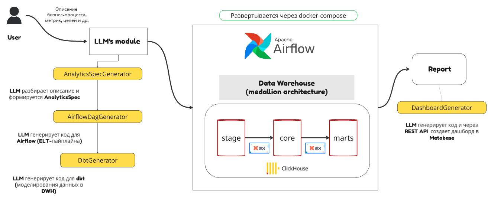

# Data Platform Automation

Прототип комплексной системы, автоматизирующей полный цикл задач по построению аналитической платформы:
1. Реализация ELT-процессов
2. Моделирование аналитического хранилища
3. Построение дашбордов

**Основная идея** - автоматизация решения типовых задач с помощью Large Language Models через API-интерфейс.

## Architecture

Система реализована по модульному принципу и включает 4 основных LLM-компонента:

| Модуль    | Описание |
| -------- | ------- |
| `AnalyticsSpecGenerator` | Модуль для работы с пользовательским вводом. На основе описания желаемой аналитической системы (источники данных, метрики и т.д.) с помощью LLM формируется структурированное техническое задание (AnalyticsSpecification). Включает автоматические рекомендации по метрикам и преобразованиям. |
| `AirflowDagGenerator`  | Модуль для генерации DAG-файлов Airflow. Использует спецификацию из первого модуля для создания пайплайнов (шаблонные вызовы dbt-команд, функции для извлечения и загрузки данных). Итоговый DAG сохраняется в директорию, смонтированную в Docker-контейнер Airflow.    |
| `DbtGenerator`  | Модуль для автоматической генерации dbt-проекта: SQL-модели, документация (yml), тесты качества данных. Использует описание метрик и преобразований из AnalyticsSpecification. Проект сохраняется для последующего запуска в Airflow.    |
| `DashboardGenerator`  |  Модуль для генерации json-описаний дашбордов и визуализаций. Использует REST API Metabase для автоматического создания аналитических отчетов.   |

## Technology Stack

* *Airflow* — организация и управление ELT-процессами
* *dbt* — моделирование и трансформация данных
* *Clickhouse* — аналитическое хранилище данных
* *Metabase* — BI-система для визуализации и построения дашбордов
* *Docker Compose* — контейнеризация и оркестрация сервисов
* *Caila* — прокси-сервис для взаимодействия с LLM
* *Langchain* — доступ к LLM и обработка естественного языка
* *Streamlit* — пользовательский интерфейс

## Repository Structure

| Директория   | Описание |
| -------- | ------- |
| **src** | Исходный код llm-модулей, модель структурированного ТЗ, конфигурационные файлы для управления проектом, промпты, шаблоны и тесты
| **experiments** | Актуальные jupyter-ноутбуки с экспериментами над прототипом, а также результаты генерации dbt-проектов и airflow-пайплайнов
| **artifacts** | Специальная директория, предназначенная для сохранения генерируемых с помощью llm-модулей файлов. Примонтирована к Docker-контейнеру.
| **infra** | Дополнительные файлы, описывающее используемое окружение
| **ui** | Код пользовательского интерфейса
